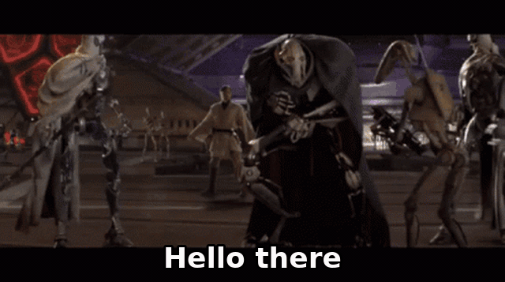
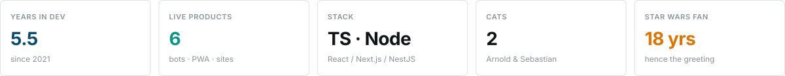
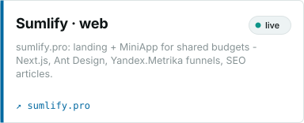
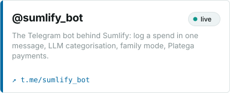
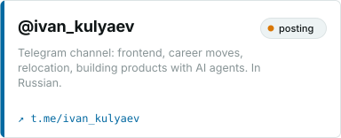

- 💻 I write React / Next.js / TypeScript on the front and Node.js / NestJS / Express behind it
- 🧑‍💻 Interested in IT and how it transforms a business - so I ship whole products, not just screens
- 🔥 A Star Wars fan for 18 years (hence the greeting)
- 🐈 Two cats: Arnold and Sebastian

## What I build

<table>
  <tr>
    <td width="33%"></td>
    <td width="33%"></td>
    <td width="33%"></td>
  </tr>
</table>

## Stack

## Contact

&nbsp;

**Telegram:** [@takemeright](https://t.me/takemeright) · **Channel:** [@ivan_kulyaev](https://t.me/ivan_kulyaev)
